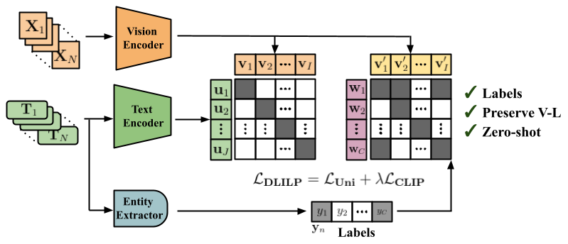

## Disentangled Language-Image-Label Pre-training

 <br/>

<b>A Reality Check of Vision-Language Pre-training in Radiology: Have We Progressed Using Text?</b> <br/>
📜 <span style="color:red">*Information Processing in Medical Imaging*</span> \
[Julio Silva-Rodríguez](https://scholar.google.es/citations?user=1UMYgHMAAAAJ&hl),
[Jose Dolz](https://scholar.google.es/citations?user=yHQIFFMAAAAJ&hl),
[Ismail Ben Ayed](https://scholar.google.es/citations?user=29vyUccAAAAJ&hl)
<br/>
ÉTS Montréal
<br/>
| [Project](https://jusiro.github.io/projects/dlilp) | [Conference](https://arxiv.org/abs/2504.05227) | [ArXiv](https://arxiv.org/abs/2504.05227) | [Code](https://github.com/jusiro/DLILP) |
<br/>

### Summary

In this work, we focus on **pre-training large-scale vision models for chest X-ray (CXR) understanding**.
In this domain, raw datasets naturally present text supervision thanks to medical reports. Nevertheless, only a few
datasets with such information are available, as **fine-grained label supervision** is the most popular choice. 
Nevertheless, current literature is mostly focused on **vision-language pre-training, 
which might struggle to incorporate label information**, and thus fail to properly scale to integrate more datasets. In contrast, we propose:

- **Unimodal pre-training** using image-label information.
- **Disentangled Language-Image-Label Pre-training**, **DLILP**, which separately aligns  image-text and image-label supervision.

### Install

* Install in your enviroment a compatible torch version with your GPU. For example:
```
conda create -n dlilp python=3.11 -y
conda activate dlilp
conda install pytorch==2.0.1 torchvision==0.15.2 torchaudio==2.0.2 pytorch-cuda=11.7 -c pytorch -c nvidia
```

```
git clone https://github.com/jusiro/DLILP.git
cd DLILP
pip install -r requirements.txt
```

### Datasets

1. **Download datasets**. Please, check [`./local_data/datasets/README.md`](./local_data/datasets/README.md) for expected datasets structure, links, and instructions.
2. Define the **relative paths for datasets** in [`./local_data/constants.py`](./local_data/constants.py).
3. Create dataset **partitions** for pre-training and transferability. Follow the instructions at [`./local_data/partitions/README.md`](./local_data/partitions/README.md), and execute `python ./local_data/partitions/partitions.py`.

### Model pre-training

* Contrastive language-image pretraining - **CLIP**.

```
python main_pretrain.py --learning_criteria clip --exp_id clip_CM --datasets CheXpert-train-frontal,MIMIC-CXR-2-train-frontal
```

* Unified contrastive representations in the label space - **UniCL**.

```
python main_pretrain.py --learning_criteria unicl --exp_id unicl_CM --datasets CheXpert-train-frontal,MIMIC-CXR-2-train-frontal
```

* **Unimodal** (only vision) pre-training.

```
python main_pretrain.py --learning_criteria unimodal --exp_id unimodal_CM --datasets CheXpert-train-frontal,MIMIC-CXR-2-train-frontal
```

* Disentangled language-image-label pre-training - **DLILP**.

```
python main_pretrain.py --learning_criteria dlilp --exp_id dlilp_CM --datasets CheXpert-train-frontal,MIMIC-CXR-2-train-frontal
```

### Pre-trained weights download

We provide our pre-trained weights in the following [LINK](https://1drv.ms/f/c/012ee12cadd5b31d/Eh2z1a0s4S4ggAFuoAAAAAAB55qMt26nI0kDIgg56XKJNg?e=kYl7IF).
You can manually download the weights, and store them at: `./cxrvlms/modeling/pretrained_weights/[ID].pth`. They present the following [ID]: "method_dataset",
e.g. dlilp_MCP stands for the pre-training strategy DLILP, using Mimic (M), CheXpert (C) and PadChest (P) datasets.


### Transferability to downstream tasks/domains

* **Zero-shot**

```
python main_transferability.py --experiment chexpert_5x200 --method zero_shot --load_weights True --ensemble True --shots_train 80% --shots_test 20% --folds 5 
python main_transferability.py --experiment mimic_5x200 --method zero_shot --load_weights True --ensemble True --shots_train 80% --shots_test 20%  --folds 5 
python main_transferability.py --experiment covid_train --method zero_shot --load_weights True --ensemble True --shots_train 100% --shots_test 0% --experiment_test covid_test --folds 1 
python main_transferability.py --experiment rsna_pneumonia_train --method zero_shot --load_weights True --ensemble True --shots_train 100% --shots_test 0% --experiment_test rsna_pneumonia_test --folds 1 
```

* **Linear Probing**

```
python main_transferability.py --experiment chexpert_5x200 --method lp --load_weights True --ensemble True --shots_train 16 --shots_test 20% --folds 5 
python main_transferability.py --experiment mimic_5x200 --method lp --load_weights True --ensemble True --shots_train 16 --shots_test 20%  --folds 5 
python main_transferability.py --experiment covid_train --method lp --load_weights True --ensemble True --shots_train 16 --shots_test 0% --experiment_test covid_test --folds 5
python main_transferability.py --experiment rsna_pneumonia_train --method lp --load_weights True --ensemble True --shots_train 16 --shots_test 0% --experiment_test rsna_pneumonia_test --folds 5  
```

### Using other pre-trained models

We also have prepared the framework for evaluating the Linear Probing of recent released models. Note that some details
such as image normalization or size might vary. We present some examples of calls below, but additional are incldued at
[`./local_data/examples/sota.txt`](./local_data/examples/sota.txt). If interested, please refer to [MedKLIP](MedKLIP),
[KED](KED), [BioVIL](BioVIL), [GlorIA](GlorIA), [MedCLIP](MedCLIP), or [CXR-CLIP](CXR-CLIP) repositories and allocate their
ResNet-50 weights at [`./cxrvlms/modeling/pretrained_weights/other/`](./cxrvlms/modeling/pretrained_weights/other/).

```
# MedKLIP (ICCV23)
python main_transferability.py --experiment chexpert_5x200 --method lp --shots_train 16 --shots_test 20% --folds 5 --norm True --size 224 --weights_path ./cxrvlms/modeling/pretrained_weights/other/medklip.pth
# KED (Nat.Comm.23)
python main_transferability.py --experiment chexpert_5x200 --method lp --shots_train 16 --shots_test 20% --folds 5 --norm True --size 224 --weights_path ./cxrvlms/modeling/pretrained_weights/other/KAD.pt
# BioVIL (Nat.Comm.23)
python main_transferability.py --experiment chexpert_5x200 --method lp --shots_train 16 --shots_test 20% --folds 5 --norm False --size 512 --weights_path ./cxrvlms/modeling/pretrained_weights/other/biovil.pt
# GlorIA (ICCV21)
python main_transferability.py --experiment chexpert_5x200 --method lp --shots_train 16 --shots_test 20% --folds 5 --norm True --size 224 --weights_path ./cxrvlms/modeling/pretrained_weights/other/gloria_weights.ckpt
# MedCLIP (EMNLP22)
python main_transferability.py --experiment chexpert_5x200 --method lp --shots_train 16 --shots_test 20% --folds 5 --norm True --size 224 --weights_path ./cxrvlms/modeling/pretrained_weights/other/medclip_weights.bin
# CXR-CLIP (MICCAI23)
python main_transferability.py --experiment chexpert_5x200 --method lp --shots_train 16 --shots_test 20% --folds 5 --norm True --size 224 --weights_path ./cxrvlms/modeling/pretrained_weights/other/cxr-clip.tar
```

# Citation

If you find this repository useful, please consider citing this paper:
```
@inproceedings{dlilp,
    title={A Reality Check of Vision-Language Pre-training in Radiology: Have We Progressed Using Text?},
    author={Julio Silva-Rodríguez and Jose Dolz and Ismail {Ben Ayed}},
    booktitle={Information Processing in Medical Imaging (IPMI)},
    year={2025}
}
```
